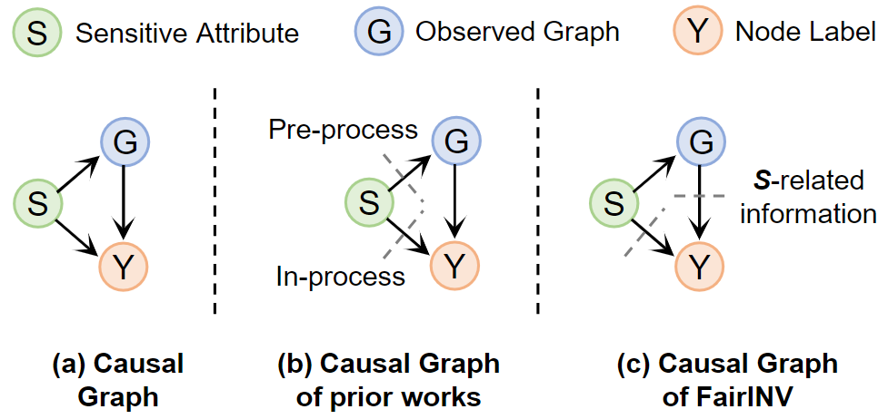
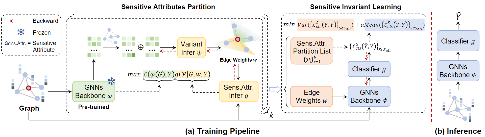

# FairINV
An official PyTorch implementation of FairINV (**Paper Title:** One Fits All: Learning Fair Graph Neural Networks for Various Sensitive Attributes).

## Overview
**Motivation:** Existing fairness approaches are often tailored to specific sensitive attributes. Consequently, they necessitate retraining the model from scratch to accommodate changes in the sensitive attribute requirement, resulting in high computational costs.

**Our observation:** We approach the graph fairness problem from a causal modeling perspective, where we identify the confounding effect induced by the sensitive attribute as the underlying reason, as shown in the following figure.


<div style="text-align: center;">
    
</div>

**Our solution:** we first formulate the graph fairness issue from an invariant learning perspective, where sensitive attributes as environments. Building upon this formulation, we propose a universal graph fairness framework named **FairINV**. FairINV jointly optimizes a fair GNN for multiple sensitive attributes inferred automatically via sensitive attribute partition. Meanwhile, FairINV incorporates invariant learning optimization objectives building upon sensitive attribute partition to remove confounding effects induced by the sensitive attribute. The overview of FairINV is shown as follows.

<div style="text-align: center;">
    
</div>

## Requirements
- CUDA 12.4
- torch==1.13.1
- numpy == 1.21.6
- torch-cluster==1.6.3
- torch-scatter==2.1.2
- torch-sparse==0.6.18
- torch_geometric==2.4.0


## Reproduction
The optimal hyperparameters setting of FairINV with GCN backbone is written in run_fairinv.sh. To reproduce our results, please run:
```shell
bash run_fairinv.sh
```

## Citation
If you find it useful, please cite our paper. Thank you!